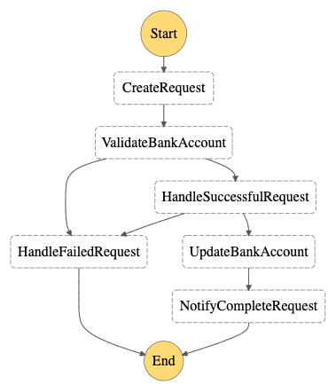

# Step Functions Example

This project is a backend API to show step functions examples. It is an API to change bank account details of users.



## Application Overview:

1. User requests a bank account change.
2. Backend service validates the bank account info. If it's invalid, notify the user of the failure.
3. Administrator will perform final checks for the bank account and the bank account change request is approved or rejected.
4. User will receive a notification.

---

## Technologies:

- Serverless Framework
- DynamoDB
- Lambda
- StepFunctions
- APIGateway

---

`BankAccountChangeRequest` is the domain object of this project.

```
type BankAccountChangeRequest = {
  userId: string
  name: string
  iban: string
  status: BankAccountChangeStatus
  requestId: string
  token?: string
  createdAt: string
  updatedAt?: string
}

type BankAccountChangeStatus =
  | 'WAITING_FOR_VALIDATION'
  | 'VALIDATION_SUCCESS'
  | 'VALIDATION_FAILED'
  | 'SUCCESS'
  | 'FAILURE'
```

---

## Use Cases

Note: API gateway is also deployed. Example requests are in the `example.http`

### CreateRequest:

Endpoint: `POST /`

User will send userId, iban and name, then the request is saved in DynamoDB table

<br>

### ValidateBankAccount:

Bank account is validated. Pseudo code is used for validation for simplicity. In a real project, it would be validated by charging 1 cent etc.

<br>

### HandleFailedRequest:

If bank account is invalid in `ValidateBankAccount` or the request is rejected manual checks, this use case is triggered. User will receive notification about the failure. (sending notification is pseudo code)

<br>

### HandleSuccessfulRequest:

Here `waitForTaskToken` is used so that an administrator can perform final checks. After the manual check, the admin calls the `ApproveBankAccountChange` endpoint.

<br>

### ApproveBankAccountChange:

Endpoint: `POST /approve/{userId}/{requestId}`

RequestBody:
`type` : `APPROVE | REJECT` \
`reason`: `String` required if type is `REJECT`

Approves or rejects the request.

<br>

### UpdateBankAccount:

Replace the current bank account info with the one of the request.

<br>

### NotifyCompleteRequest:

User will receive notification that the bank account is updated. (sending notification is pseudo code)

---

## How to Deploy:

run `yarn deploy:dev`
